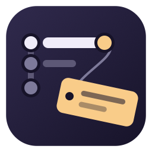

  

<h1 align="center">Gitective</h1>

<strong>Git blame, investigated.</strong> 
Who touched this line, why, and what else changed with it. Nothing more.

  
  
  
  
  

---

Most blame tooling comes bundled with sidebars, graphs, accounts, and upsells. Gitective is the
blame part only, done carefully: the current line's author at the end of the line, a hover card that
answers the next three questions, and a real VS Code diff one click away. Under 100 KB, zero
runtime dependencies, no telemetry.

<!--
  Screenshots: drop two captures into media/ and uncomment.
  1. media/hover.png  — the hover card (hover the inline annotation on any line)
  2. media/menu.png   — the commit menu (alt+shift+b)

-->

## Thirty seconds

1. Open any file in a git repository. The gray text after the current line is the blame.
2. Hover it: author, dates, full message, the exact line change, and actions.
3. Press <kbd>alt</kbd>+<kbd>shift</kbd>+<kbd>b</kbd> for the commit menu; click **Changes** for a real diff.
4. Inside the diff, use the ← → buttons in the title to walk the file's history, one revision at a time.

## What you get

**Inline blame** on the current line, tinted by age (today is amber, last year is gray). Edits you
haven't saved yet show as uncommitted immediately, never as someone else's commit.

**Hover card**: avatar, author linked to their GitHub profile, a shield when the commit is signed
(green if verified), relative and absolute dates, the full commit message, then one compact row of
actions. A second section shows the blamed line's own diff line, copyable on its own, and a
`Changes a ↔ b` link to the diff. "You" means the commit email matches this repo's `user.email`.

**Commit menu**, one grouped menu per commit: changes in this file, changes vs the working tree, all
changed files, inspect commit; open or copy the commit link on GitHub, GitLab or Bitbucket; file and
line history; copy SHA or message; and four git actions that never rewrite history: create branch,
create tag, revert, checkout detached.

**Real diffs**, parent ↔ commit, in the normal VS Code diff editor. Both panes blame themselves, so
you can hover inside an old revision and keep going back. Snapshot tabs are named `file @ sha` and
keep syntax highlighting.

**Inspect commit**: a read-only text document with header, message, stat and patch, plus
"Open side-by-side" lenses on every file. Searchable, copyable, no webview.

**Search and history**: commit search as you type (message, `@author`, SHA), file history, and line
history: every commit that touched the line under the cursor.

**Status bar**: `You, 1 month ago` at the left edge of the right-hand items. Hover for the full card
with a colored files/insertions/deletions line; click for the commit menu.

Also: blame works inside VS Code's own Git diffs, `git blame -w` and `.git-blame-ignore-revs` are
one setting each, and Gitective offers once to switch off VS Code's built-in blame item so you don't
see two.

## Keys

| Key | Does | When |
| --- | --- | --- |
| <kbd>alt</kbd>+<kbd>shift</kbd>+<kbd>b</kbd> | Commit menu for the current line | editor focused |
| <kbd>alt</kbd>+<kbd>shift</kbd>+<kbd>h</kbd> | Line history | editor focused |
| <kbd>alt</kbd>+<kbd>shift</kbd>+<kbd>,</kbd> / <kbd>.</kbd> | Older / newer revision | a Gitective revision or diff tab is active |

## Settings

| Setting | Default | Description |
| --- | --- | --- |
| `gitective.inline.enabled` | `true` | Inline blame for the current line |
| `gitective.inline.format` | `${author}, ${ago} • ${message}` | Inline template |
| `gitective.inline.ageTint` | `true` | Tint the annotation by commit age (`gitective.inlineBlame.age1…age5` colors) |
| `gitective.hover.enabled` | `true` | Blame hover card |
| `gitective.hover.trigger` | `annotation` | Card over the inline annotation only, or `line` for any line |
| `gitective.hover.avatars` | `true` | Author avatars (GitHub, Gravatar; cached; initials offline) |
| `gitective.hover.showChanges` | `true` | The blamed line's own diff line in the hover |
| `gitective.statusBar.enabled` | `true` | Status bar blame (click opens the commit menu) |
| `gitective.statusBar.format` | `$(git-commit) ${author}, ${ago}` | Status bar template (codicons allowed) |
| `gitective.dateFormat` | `medium` | Absolute date style for `${date}`, `${agoOrDate}`, hover |
| `gitective.message.maxLength` | `60` | Message truncation for inline and status bar |
| `gitective.blame.ignoreWhitespace` | `false` | `git blame -w`: reformatting commits stop claiming lines |
| `gitective.blame.ignoreRevsFile` | `true` | Honor `.git-blame-ignore-revs` at the repo root |

Template tokens: `${author}` `${authorEmail}` `${ago}` `${agoOrDate}` `${date}` `${message}` `${sha}`.
`${agoOrDate}` is relative under 30 days and an absolute date after.

## Commands

`Gitective:` Commit Menu for Current Line · Inspect Commit · Changes with Previous Revision · Changes
with Working Tree · Open File at Revision · File History · Line History · Search Commits · Open Commit
on Remote · Copy Commit Link · Copy Commit SHA · Copy Commit Message · Older / Newer Revision · Toggle
Inline Blame.

## Compared with

| | Gitective | GitLens | VS Code built-in blame |
| --- | --- | --- | --- |
| Current-line blame, hover, real diffs | yes | yes | status bar and hover only |
| Commit menu with safe git actions | yes | yes, plus reset and rebase | no |
| Line history, file history, search | QuickPicks | sidebar views | no |
| Sidebars, commit graph, worktrees, AI | no, on purpose | yes | no |
| Account, telemetry, paid tier | none | yes | none |
| Size | under 100 KB | tens of MB | built in |

If you want the graph and the views, GitLens is excellent. If you want blame that stays out of the
way, this is the tool.

## Privacy

No telemetry. Git runs locally. The only network use is author avatars: GitHub via the repo's
`origin` (reusing an existing VS Code GitHub session, never prompting), then Gravatar, cached locally
for a week, with initials drawn when nothing is cached. Set `gitective.hover.avatars` to `false` and
Gitective never touches the network.

## Requirements

- `git` on your PATH. Files larger than 5 MB are not blamed.
- Untrusted and virtual workspaces are not supported (Gitective runs git in your workspace).

## Contributing

`bun install`, then `F5` for an Extension Development Host. Run `bun run check && bun run lint &&
bun run test && bun run test:vsc` before a PR. Details in [CONTRIBUTING.md](CONTRIBUTING.md).

## License

[MIT](LICENSE)
